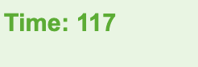

# Coding-Quiz
##Description

I have created an online quiz with some questions relating to HTML, CSS, JavaScript, and GitHub. It utilises local storage to store users score and save them to a Highscores page.

##Installation

No installation needed. The code is deployed as a stand alone page on Git Pages, (https://karra-ormsby.github.io/Coding-Quiz/index.html)

##Usage

From the start screen you can either click the 'Start' button 

to start the quiz or click the 'View Highscores' button,

 

which takes the user to another page where the highscores are listed. Upon clicking 'Start', a timer starts (which can be seen in the top left hand corner) 

and the user is presented with a question with four possible answers.  If the user chooses correctly they will gain a point, but if they choose an incorrect answer they are met with a 10 second time penalty. The quiz ends when either the user makes their way through all the questions, or when the time runs out. When the quiz ends the user is presented with a screen where they are told the amount of points they scored and prompted to input their initials. 

Once they click the 'Submit' button they are brought to the Highcores page where they can see how they faired against other users. 
On the highscores page 

there is a list of past participants scores and two buttons. One, 'Clear Highscores', which will clear the highscores from the page. The other, 'go back', which will return the user the to the starting page of the quiz.

##Credit

All questions used in this quiz were taken from the Practice Interview Questions Quiz found at the end of each module, as part of the Coding Bootcamp. Reached out to Ask BCS for help with retrieving highscores from local storage, and planning ahead -> when is the right time to make point and object. Reached out to tutoring services for help with the logic used to generate a new question, 'design by contract' programming, and how to check if only an answer has been clicked.2